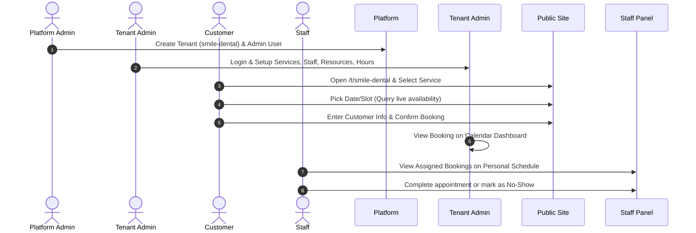

# ReserveFlow: Product Overview

ReserveFlow is a multi-tenant appointment, scheduling, and resource-booking SaaS platform. It enables service-based businesses (tenants) to manage their schedules, staff, resources, and booking policies while allowing customers to search, find availability, and book appointments seamlessly.

---

## 1. The Real-World Problem
Service-based businesses face significant operational hurdles when managing bookings manually or using basic calendar applications:
* **Resource Overlap:** A single practitioner or physical room gets double-booked, causing service delays and client dissatisfaction.
* **Complex Scheduling Rules:** Staff members have varying shift hours, lunch breaks, planned leaves, and service-specific preparation times that are difficult to coordinate.
* **No-Show and Late Cancellation Losses:** Cancellations without proper notice lead to empty slots and direct financial loss.
* **Multi-Tenancy Desires:** Standard single-tenant systems require separate infrastructure setups per client, increasing maintenance costs and complexity for SaaS operators.
* **Timezone Discrepancies:** Virtual appointments are booked across different timezones, leading to missed calls due to calculation errors.

---

## 2. Who Uses ReserveFlow (Actors)

| Actor | Role Description | Key Motivations |
| :--- | :--- | :--- |
| **Platform Admin** | SaaS System Owner | Manage tenant onboarding, monitor platform usage, category tagging, global billing/subscription, and tenant suspension. |
| **Tenant Admin** | Business Owner / Manager | Configure services, onboarding staff, manage business resources, define booking policies, track staff utilization, and view dashboard analytics. |
| **Staff Member** | Service Provider / Practitioner | View individual schedules, perform assigned services, block personal unavailable periods, and mark bookings as completed or no-show. |
| **Customer** | End User / Public Client | Easily discover local businesses, view live slots, book, reschedule, or cancel bookings, and receive automatic notifications. |

---

## 3. How ReserveFlow Works

### In Real Life (The Business Context)
1. **Onboarding:** A local business, *Smile Dental Clinic*, registers on the ReserveFlow platform to automate its appointment booking.
2. **Setup:** The clinic administrator defines services (*Dental Cleaning, Root Canal*), registers dentists (*Dr. Smith, Dr. Doe*), and specifies resources (*Dental Chair A, Treatment Room 1*).
3. **Availability Mapping:** They configure working hours (09:00 - 17:00, Monday to Friday) and add booking policies (minimum 2 hours notice, max 24 hours cancellation).
4. **Booking:** A customer visits the public page of the clinic, picks *Dental Cleaning* with *Dr. Smith* on Friday at 10:00 AM, and books. The physical chair and doctor are reserved instantly.
5. **Fulfillment:** The customer arrives, the service is rendered, and the dentist marks the booking as completed.

### Inside the Software (The Engineering Context)
1. **Multi-Tenancy Resolution:** The frontend resolves the tenant context using the URL slug (`/t/smile-dental`). The backend isolates all queries utilizing a global `TenantId` filter.
2. **OIDC Authentication:** Identity management and authentication are delegated to **Keycloak**. Angular utilizes Authorization Code + PKCE. Users are mapped to local user profiles inside the Modular Monolith schema.
3. **Resource Locking:** The Scheduling module calculates availability slots by evaluating the intersection of **Staff Working Hours**, **Resource Calendars**, and **Existing Bookings** while locking slots to prevent race-condition double-booking.
4. **Transactional Outbox/Inbox:** Booking state changes write to the Database. In the same transaction, a message is written to the `outbox_messages` table. An asynchronous worker picks this up to dispatch notifications, avoiding API blockages.

---

## 4. Main Business Flows (The Core Loop)

---

## 5. MVP Scope vs. Advanced Future Scope

### MVP Scope (Included)
* **Shared Database Tenancy:** Isolated tables via `TenantId` discriminator + EF Core global filters.
* **Modular Monolith Core:** Domain-driven modules (`Identity`, `Tenants`, `Catalog`, `Staffing`, `Resources`, `Scheduling`, `Bookings`, `Notifications`).
* **Availability Search Engine:** Time-slot generator considering staff shifts, buffers, holidays, and resource limits.
* **Core Booking Lifecycle:** Draft/Pending, Confirmed, Rescheduled, Cancelled, Completed, NoShow states.
* **Notification Flow:** Fake notification engine with transactional Outbox to inspect queues.
* **Angular 20+ Client:** Core layouts, responsive scheduling UI, lazy routes, Signals-based state, interceptors.

### Advanced Future Scope (Not in MVP)
* **Schema-per-Tenant or Database-per-Tenant:** Scaling to isolate high-tier enterprise clients.
* **Payment Gateways:** Stripe or PayPal integrations to request deposits during slot booking.
* **Two-Way Calendar Sync:** Integrating Google Calendar, Outlook, and Apple Calendar API webhooks.
* **Waitlist Optimization:** Automatically offering cancelled slots to waitlisted customers.
* **Advanced Analytics:** Predictive staffing and revenue forecasting reports.
* **Native Mobile Apps:** Separate iOS/Android apps for Staff and Customers.
