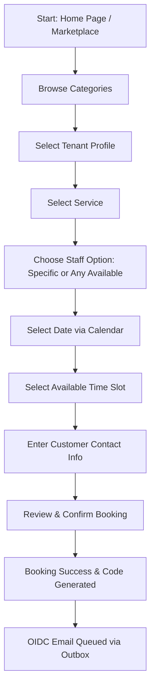
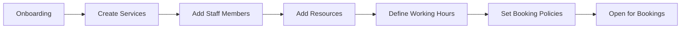

# ReserveFlow: User Roles and Flows

This document details the user personas, permissions, and step-by-step UI journeys for each actor in the ReserveFlow SaaS ecosystem.

---

## 1. Actor Directory & Permissions Matrix

ReserveFlow enforces a strict Role-Based Access Control (RBAC) model. Below are the key roles and their respective permissions:

| Actor Role | Scope | Key Permissions | UI Sections Accessible |
| :--- | :--- | :--- | :--- |
| **Platform Admin** | Global (All Tenants) | `Platform.Tenants.Manage`, `Platform.Categories.Manage`, `Platform.Usage.View`, `Platform.Audit.View` | Platform Admin Dashboard (`/platform/*`) |
| **Tenant Admin** | Tenant Isolation | `Tenant.Services.Manage`, `Tenant.Staff.Manage`, `Tenant.Resources.Manage`, `Bookings.Manage`, `Reports.View` | Tenant Admin Portal (`/admin/*`) |
| **Staff Member** | Assigned Scope | `Staff.Schedule.View`, `Staff.UnavailablePeriods.Manage`, `Bookings.UpdateStatus` | Staff Dashboard (`/staff/*`) |
| **Customer / Public**| Anonymous / Self | `Bookings.Create`, `Bookings.CancelOwn`, `Bookings.ViewOwn` | Public Site (`/t/*`, `/booking/*`), Customer Portal (`/customer/*`) |

---

## 2. Customer / Public Flow (The Booking Journey)

This is the most critical public-facing flow. It must be simple, friction-free, and fully mobile-responsive.

### Detailed Customer Step-by-Step UI Journey:
1. **Discover:** Customer lands on the homepage `/` and chooses a business category (e.g., "Health & Wellness").
2. **Select Tenant:** The category view `/categories/:categorySlug` displays active tenant cards. The customer selects *Smile Dental Clinic*, navigating to `/t/smile-dental`.
3. **Select Service:** The tenant profile displays service cards grouped by section. Customer clicks "Book" on *Dental Consultation ($80)*.
4. **Define Preferences:** The Booking Wizard `/t/smile-dental/book` opens. Customer chooses whether they want a specific doctor (*Dr. Jones*) or selects *"Any Available"* to see the maximum number of slots.
5. **Slot Selection:** The wizard displays a calendar. Customer selects a date. The system calls `/api/public/tenants/smile-dental/availability` and returns valid time slots. The customer clicks `10:15 AM`.
6. **Form Details:** Customer enters their Name, Email, Phone, and any special notes.
7. **Confirmation:** Clicking "Confirm Booking" fires the `POST` command. If successful, the customer is redirected to `/booking/:bookingCode` with a booking confirmation badge, details, and cancellation/reschedule links.

---

## 3. Tenant Admin Flow (Business Management)

The Tenant Admin configures the scheduling engine's inputs. A business cannot receive bookings until the admin completes setup.

### Detailed Tenant Admin Step-by-Step UI Journey:
1. **Tenant Provisioning:** The Tenant Admin logs into `/admin/` for the first time. The layout presents an onboarding checklist.
2. **Services CRUD:** Admin navigates to `/admin/services` and adds services. For each, they configure Name, Duration, Price, Buffer Time, and required resources.
3. **Staff Setup:** In `/admin/staff`, the admin creates staff records, assigns them to services, and sets up Keycloak user association so the staff members can log in.
4. **Resource Management:** Admin navigates to `/admin/resources` and defines critical items like "Room A" or "Dental Chair 1" that are required to render services.
5. **Hours & Blackouts:** Admin defines weekly operating hours and logs corporate holidays or service blackout dates.
6. **Booking Policies:** Admin navigates to `/admin/booking-policies` to enforce rules:
   * Minimum booking notice (e.g., "no bookings within 2 hours of slot").
   * Cancellation window (e.g., "cannot cancel within 24 hours").
7. **Booking Management:** The admin uses `/admin/bookings` (Calendar & List view) to monitor incoming bookings. They can manually reschedule or cancel bookings, or trigger email overrides.

---

## 4. Staff Flow (Schedule & Availability)

Staff users require a fast, mobile-friendly panel to check their schedules on the go.

### Detailed Staff Step-by-Step UI Journey:
1. **View Personal Schedule:** Staff logs into `/staff/schedule`. They see a daily calendar and list of today's appointments.
2. **Consult Appointments:** Clicking an appointment opens a drawer displaying Customer Info, Services, and duration details.
3. **Trigger Actions:**
   * **Mark Completed:** When the service is finished, the staff member clicks "Complete" to change the booking status to `Completed`.
   * **Mark No-Show:** If the client fails to arrive within 15 minutes, the staff member selects "Mark No-Show".
4. **Manage Unavailable Periods:** The staff member navigates to `/staff/unavailable-periods`. They can quickly click and drag on the calendar to log personal blocks (e.g., "Doctor's Appointment" or "Emergency Leave"), which instantly updates the scheduling engine.

---

## 5. Platform Admin Flow (Global Management)

Platform Admins do not manage daily bookings; they govern the SaaS infrastructure.

### Detailed Platform Admin Step-by-Step UI Journey:
1. **Dashboard Check:** Platform Admin lands on `/platform` and inspects global graphs (active tenants, platform booking volume, server loads).
2. **Tenant Creation:** Admin clicks "Create Tenant" at `/platform/tenants/create`. They input Business Name, Slug, Category, Owner's Name, Owner's Email, and time zone.
3. **Keycloak Integration:** Upon submitting, the system calls `/api/platform/tenants` to provision the tenant and create the Tenant Admin Keycloak account, sending a welcome reset-password email.
4. **Tenant Status Control:** Platform admin visits `/platform/tenants/:id` and can click **Activate** or **Suspend** (which blocks public booking routing and API access for that tenant immediately).
5. **Auditing:** Platform admin accesses `/platform/audit-logs` to review sensitive activity (tenant creations, security overrides, and suspension updates).
