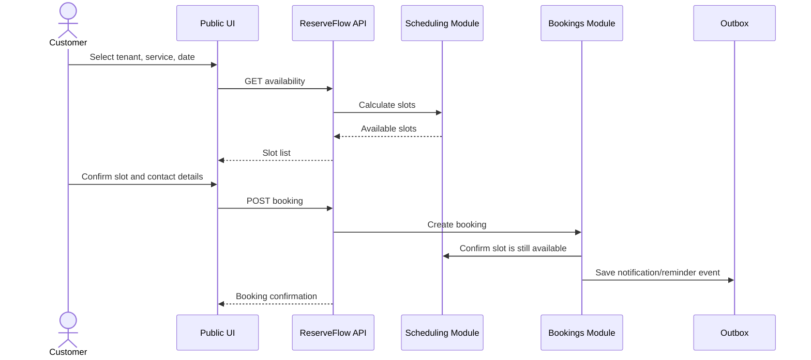

# Users And Flows

ReserveFlow has four main user groups: Customer, Staff, Tenant Admin, and Platform Admin.

## Customer

Customer is the person booking a service or resource.

Real-life examples:

- A patient books a dental consultation.
- A client books a haircut.
- A student books an IELTS lesson.
- A startup founder books a coworking meeting room.

App flow:

1. Opens the public marketplace.
2. Chooses a category such as Clinic, Barber, Coworking, Tutor, or Consultant.
3. Chooses a tenant such as Smile Dental Clinic.
4. Views tenant profile and active services.
5. Selects a service.
6. Selects staff, resource, or `Any available` when allowed.
7. Selects a date.
8. Views available slots in the tenant's local timezone.
9. Enters contact details or logs in.
10. Confirms booking.
11. Receives confirmation and reminders.
12. Can look up booking by booking code/token and cancel or reschedule if policy allows.

Customer permissions are intentionally narrow. A customer can only manage their own booking through a secure lookup token or authenticated account.

## Tenant Admin

Tenant Admin manages one business inside the platform.

Real-life examples:

- Smile Dental Clinic owner
- Elite Barber Shop manager
- WorkHub Coworking administrator

App flow:

1. Logs into tenant admin panel.
2. Is redirected to Keycloak for sign-in when not authenticated.
3. Configures tenant profile: name, slug, public description, timezone, contact info.
4. Creates services with duration, price, buffers, staff/resource requirements.
5. Adds staff members and assigns services.
6. Adds resources such as rooms, chairs, equipment, or meeting rooms.
7. Sets weekly working hours.
8. Adds blackout or unavailable periods.
9. Sets booking policies: minimum notice, cancellation deadline, booking window.
10. Views bookings by date, status, staff, service, or resource.
11. Cancels, reschedules, completes, or marks no-show when allowed.
12. Views reports and notification logs.

Tenant Admin must only see data for their own tenant.

## Staff

Staff is the person who performs a service or owns a working calendar.

Real-life examples:

- Doctor
- Barber
- Coach
- Consultant
- Teacher

App flow:

1. Logs into staff panel.
2. Is redirected to Keycloak for sign-in when not authenticated.
3. Views daily or weekly schedule.
4. Opens booking details for assigned appointments.
5. Marks booking as completed.
6. Marks no-show.
7. Adds personal unavailable periods if tenant policy allows it.

Staff does not manage tenant-level configuration unless also given Tenant Admin permissions.

## Platform Admin

Platform Admin manages ReserveFlow as a SaaS platform.

App flow:

1. Logs into platform admin panel.
2. Is redirected to Keycloak for sign-in when not authenticated.
3. Creates global categories.
4. Creates tenants.
5. Assigns tenant owner/admin user.
6. Activates or suspends tenants.
7. Reviews platform usage.
8. Views platform audit logs.

Platform Admin should not handle normal daily bookings unless there is a support or audit need.

## Main Booking Flow

## Tenant Isolation Rule

Every tenant user action must answer three questions:

- Who is the current user?
- Which tenant is this request for?
- Does the user have permission for this tenant and resource?

If the answer is not clear, the request must fail.

## References

- [ASP.NET Core authorization policies](https://learn.microsoft.com/en-us/aspnet/core/security/authorization/policies)
- [Keycloak securing applications overview](https://www.keycloak.org/securing-apps/overview)
- [EF Core multi-tenancy](https://learn.microsoft.com/en-us/ef/core/miscellaneous/multitenancy)
