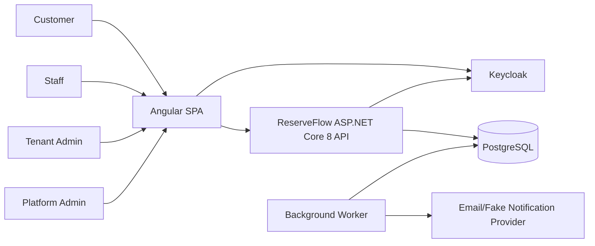

# Overall Architecture

## Architecture Style

ReserveFlow uses:

- Modular monolith
- Clean Architecture inside modules
- Vertical slices for use cases
- Lightweight CQRS
- Domain events for in-process reactions
- Outbox for reliable notifications and integration messages

This gives the project real architecture boundaries without the early operational cost of microservices.

## Reference Blueprint

ReserveFlow follows the same practical module shape studied from the local Milan Jovanovic/Evently course code:

- `Common.Domain`, `Common.Application`, `Common.Infrastructure`, and `Common.Presentation` shared building blocks.
- One API composition root that loads module application assemblies, module configuration files, infrastructure, health checks, and module registration extensions.
- Each business module has separate `Domain`, `Application`, `Infrastructure`, `IntegrationEvents`, and `Presentation` projects.
- Presentation endpoints are registered by convention from module assemblies.
- Each module owns its EF Core context, PostgreSQL schema, migrations history table, outbox processor, and inbox processor when needed.
- Architecture tests protect module independence and layer dependency direction.

This blueprint is combined with DDD module isolation from kgrzybek, Clean Architecture conventions from Jason Taylor and Ardalis, and Keycloak's application securing model.

## System Context



## Container View

The MVP can run as:

- `ReserveFlow.Api`: ASP.NET Core 8 Web API and background processor in one process for local development.
- `ReserveFlow.Web`: Angular SPA served by dev server locally and Nginx/static hosting in production.
- `Keycloak`: OpenID Connect/OAuth2 identity provider for login, registration, password reset, SSO, and token issuance.
- `PostgreSQL`: primary database.

Production can split the worker:

- `ReserveFlow.Api`: HTTP requests only.
- `ReserveFlow.Worker`: outbox, reminders, cleanup, and scheduled jobs.

## Module Boundaries

Backend modules:

- Identity
- Tenants
- Catalog
- Staffing
- Resources
- Scheduling
- Bookings
- Notifications
- Reporting
- Audit

Each module owns its write model. Cross-module communication should use one of:

- Application service interface exposed by the module
- Domain event inside the same module
- Integration event/outbox for cross-module or external reactions
- Read-only projection when a query needs combined data

## Dependency Direction

Inside a module:

```text
Presentation -> Application -> Domain
Infrastructure -> Application
Infrastructure -> Domain
Domain -> no framework dependencies
```

Domain code must not reference ASP.NET Core, EF Core, Npgsql, OpenTelemetry, Hangfire, or UI concerns.

## API Host Rule

The API host stays thin:

1. Authenticate.
2. Resolve tenant context.
3. Authorize.
4. Map module endpoint.
5. Dispatch command/query to a slice.
6. Return response or ProblemDetails.

Business rules live in application/domain layers, not endpoint handlers.

Authentication is delegated to Keycloak. ReserveFlow validates Keycloak-issued access tokens and owns application-specific tenant memberships, permissions, and resource authorization.

## Target Project Layout

```text
src/
  API/
    ReserveFlow.Api/
      Program.cs
      modules.identity.json
      modules.bookings.json
      modules.notifications.json
  Common/
    ReserveFlow.Common.Domain/
    ReserveFlow.Common.Application/
    ReserveFlow.Common.Infrastructure/
    ReserveFlow.Common.Presentation/
  Modules/
    Bookings/
      ReserveFlow.Modules.Bookings.Domain/
      ReserveFlow.Modules.Bookings.Application/
      ReserveFlow.Modules.Bookings.Infrastructure/
      ReserveFlow.Modules.Bookings.IntegrationEvents/
      ReserveFlow.Modules.Bookings.Presentation/
    Scheduling/
      ReserveFlow.Modules.Scheduling.Domain/
      ReserveFlow.Modules.Scheduling.Application/
      ReserveFlow.Modules.Scheduling.Infrastructure/
      ReserveFlow.Modules.Scheduling.IntegrationEvents/
      ReserveFlow.Modules.Scheduling.Presentation/
```

Every module follows the same shape unless it has a strong reason not to. Small modules can start with fewer use cases, but they should not break the dependency rules.

## Data Ownership

The database is one physical PostgreSQL database with per-module schemas. Example:

- `identity.users`
- `platform.tenants`
- `catalog.services`
- `staffing.staff_members`
- `resources.resources`
- `bookings.bookings`
- `bookings.outbox_messages`
- `notifications.inbox_messages`

Tenant-owned data includes `tenant_id`.

## Why Not Microservices First

ReserveFlow has enough business complexity to benefit from modular boundaries, but not enough operational maturity at MVP stage to justify service discovery, distributed transactions, message brokers, independent deployments, and failure choreography.

A modular monolith lets the project learn good boundaries while keeping build, debug, deploy, and test loops simple.

## References

- [kgrzybek/modular-monolith-with-ddd](https://github.com/kgrzybek/modular-monolith-with-ddd)
- [jasontaylordev/CleanArchitecture](https://github.com/jasontaylordev/CleanArchitecture)
- [ardalis/CleanArchitecture](https://github.com/ardalis/CleanArchitecture)
- [Keycloak securing applications overview](https://www.keycloak.org/securing-apps/overview)
