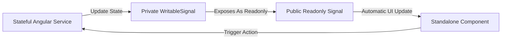

# ReserveFlow: Frontend Architecture Plan

This document details the frontend system design utilizing Angular 20+, TypeScript, Standalone Components, and Signals.

---

## 1. Architecture Pillars & Standalone Paradigm
ReserveFlow uses Angular's modern standalone architecture.
* **No NgModules:** All components, directives, and pipes are declared standalone. Dependency declarations are managed at the component level (`imports: [...]`).
* **Clean Boundaries:** The codebase is structured strictly into `core`, `shared`, and `features` directories.
* **Functional Routing:** The router relies on lazy-loaded configuration objects in `app.routes.ts` mapping directly to standalone components or feature routes.
* **Strict Type Safety:** All components and service models enforce TypeScript strict type-checking, preventing runtime errors.

---

## 2. Directory Structure

```text
src/app/
  core/                     # App-wide singleton configurations & services
    auth/                   # Keycloak wrapper, session token management, profiles
    http/                   # HTTP client configs, baseUrl configuration
    guards/                 # Auth, tenant-status, role, and permission guards
    interceptors/           # Token injector, tenant slug injector, global error parser
    tenant/                 # Tenant context extractor & Signals context holder
    permissions/            # Roles & permissions checking helpers
    config/                 # Runtime environments & feature flag configs
    errors/                 # Global error handling and logging providers
  shared/                   # Shared UI primitives, utilities, and components
    ui/                     # Design system atoms: buttons, badges, skeletons, modals
    forms/                  # Reusable form validators, inputs, date pickers
    table/                  # Reusable server-side pagination, sorting, filtering table
    calendar/               # Custom booking slot calendar / weekly agenda components
    charts/                 # Lightweight analytics visualization wrappers
    layout/                 # Shared page structure layouts (e.g., sidebar, topbar)
    pipes/                  # Currency, relative time, and localized duration formatting
    directives/             # Click-outside, tooltip, and permission visibility directives
  features/                 # Bounded contexts containing lazy-loaded routes
    public/                 # Marketplace, tenant profiles, and public booking wizard
    auth/                   # Keycloak registration redirection, profile info pages
    platform-admin/         # SaaS platform controller (tenants, categories, audits)
    tenant-admin/           # Business controller (services, staff, schedules, reports)
    staff/                  # Practitioner dashboard (schedule, completions, unavailable)
    customer/               # Public profile and customer bookings lookup dashboard
  app.routes.ts             # Main lazy routing composition mapping
  app.config.ts             # App providers (Hydration, Interceptors, Router, OIDC)
```

---

## 3. Modular Boundaries Definition

### Core Module (`/core`)
Contains singletons initialized during application bootstrap. No visual presentation components live here. Features must not import items from other features, but they can import services from `core`.
* **Services:** `AuthService`, `TenantContextService`, `PermissionService`.
* **Middlewares:** `AuthInterceptor`, `TenantInterceptor`, `ErrorInterceptor`.

### Shared Module (`/shared`)
Contains stateless UI components, customized inputs, pipes, and directives. Components in `shared` must receive state via `@Input` (or signal inputs) and emit events via `@Output` (or output emitters). They must not inject business logic services.
* **UI Controls:** Reusable `<rf-button>`, `<rf-badge>`, `<rf-table>`, and `<rf-skeleton-loader>`.

### Features Module (`/features`)
Contains the application's domain slices. Each subdirectory represents a domain context aligned with backend modules:
* Features are completely lazy-loaded.
* They define their own route files (e.g., `tenant-admin.routes.ts`) loaded via `loadChildren`.

---

## 4. State Management with Angular Signals
ReserveFlow avoids heavy state libraries like NgRx in favor of lightweight Angular Signals, wrapping shared state within scoped Services.



* **Readonly Exposure:** Services store state in private `WritableSignal` fields and expose them via public `asReadonly()` signals, enforcing unidirectional data flow.
* **Computed Derivations:** Signals leverage `computed()` to automatically derive state (e.g., filtering a booking list on the fly without recalculating raw arrays).
* **Local Component State:** Simple, page-specific states (e.g., `isDrawerOpen`, `activeTab`) are defined locally within the component class as signals.

---

## 5. Reactive Forms Pattern
Forms represent a crucial segment of the booking and setting pages.
* **Strictly Typed Forms:** ReserveFlow uses Angular's typed Reactive Forms (`FormGroup`, `FormControl`).
* **Validation UX:** Input fields in `shared/forms` display real-time inline validation errors ONLY after the input is dirtied and touched, or the form is submitted.
* **Dynamic Validation:** Form controls subscribe to signals. For example, selecting a specific service dynamically shifts validation fields for resource allocations or shifts.

---

## 6. Layout System
To prevent code duplication, routing hierarchies are wrapped inside specific layout wrapper components:
1. **`PublicLayoutComponent`:** Full-width header, footer, user account navigation dropdown.
2. **`AuthLayoutComponent`:** Centered card interface layout for auth redirects.
3. **`AdminLayoutComponent`:** Persistent left sidebar navigation (collapsible), top toolbar (containing user details and tenant picker), and content container.
4. **`StaffLayoutComponent`:** Bottom tab bar for mobile screens, side drawer for scheduling views.

---

## 7. UI UX States (Loading, Empty, Error)
Every data-driven page must implement these states to maintain high perceived performance:
* **Loading Skeletons:** Rather than generic full-screen spinners, components utilize tailwind-based skeletal divs that mirror the final loaded layout.
* **Zero Data / Empty States:** Displays a vector graphic, a clear prompt explaining the missing data, and an action button (e.g., "No staff members found. Add your first staff member").
* **Error Bounds:** Gracefully handles API errors by showing inline warning alerts or redirecting to dedicated error routes, preventing UI crashes.
