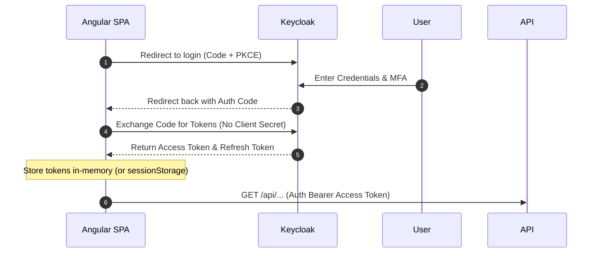

# ReserveFlow: Backend Integration Plan

This document details how the Angular frontend communicates with the .NET Modular Monolith API and handles authentication, tokens, tenant context, and API generation.

---

## 1. Authentication & Token Management (Keycloak)
ReserveFlow uses Keycloak as the Identity Provider (IdP). Authentication is secured using OpenID Connect (OIDC) Authorization Code Flow with PKCE.



### Access Token Refresh Flow
The Keycloak JavaScript adapter (`keycloak-js`) is configured to auto-update tokens:
* Before making any API request, the SPA calls `keycloak.updateToken(minValiditySeconds = 30)`.
* If the access token is near expiry, the adapter performs a background refresh using the refresh token.
* If the refresh token is expired, the user is redirected to the Keycloak login screen.

---

## 2. HTTP Interceptors
Two core HTTP interceptors process outgoing requests:

### A. Auth & Tenant Interceptor (`core/interceptors/auth-tenant.interceptor.ts`)
* **Bearer Injection:** Appends `Authorization: Bearer <AccessToken>` to request headers if the user is authenticated and the endpoint is not a public path.
* **Tenant Slug Injection:** Resolves the current tenant slug from the active route or state context. If a slug is resolved, appends `X-Tenant-Slug: <slug>` to the header. For platform routes, this header is omitted.

### B. Global Error Interceptor (`core/interceptors/error.interceptor.ts`)
* Intercepts incoming API responses.
* **401 Unauthorized:** Triggers token refresh. If refresh fails, logs out the user and clears context.
* **403 Forbidden:** Navigates to `/forbidden` access-denied page.
* **404 Not Found:** Displays a localized toast error.
* **422 Unprocessable Entity:** Formats validation payloads and forwards them to components to render forms inline.

---

## 3. API Routing Scopes

| Target Audience | Endpoint Prefix | Required Header / Auth |
| :--- | :--- | :--- |
| **Public Customers** | `/api/public/tenants/{tenantSlug}/*` | None (Anonymous allowed, optional `X-Tenant-Slug`) |
| **Tenant Admins** | `/api/admin/*` | JWT Bearer Token + Admin Permission + Scoped Tenant ID |
| **Staff Members** | `/api/staff/*` | JWT Bearer Token + Staff Permission |
| **Platform Admins**| `/api/platform/*` | JWT Bearer Token + Platform Admin Permission |

---

## 4. Backend Error Response & Validation Mapping
The backend API follows RFC 7807 **Problem Details** for HTTP APIs when returning errors.

### Example 400 Bad Request / Validation Failure:
```json
{
  "type": "https://tools.ietf.org/html/rfc7231#section-6.5.1",
  "title": "One or more validation errors occurred.",
  "status": 400,
  "detail": "Please refer to the errors property for additional details.",
  "errors": {
    "Email": [
      "The Email field is not a valid e-mail address.",
      "Email address is already in use."
    ],
    "Password": [
      "The Password must be at least 8 characters long."
    ]
  }
}
```

### Frontend Validation Mapper:
```typescript
/**
 * Maps ProblemDetails validation errors directly to Angular Reactive Form Controls
 */
export function mapValidationErrorsToForm(form: FormGroup, errorResponse: any): void {
  if (errorResponse?.errors) {
    Object.keys(errorResponse.errors).forEach(key => {
      // Normalize camelCase vs PascalCase properties
      const camelKey = key.charAt(0).toLowerCase() + key.slice(1);
      const control = form.get(camelKey) || form.get(key);
      
      if (control) {
        control.setErrors({
          serverError: errorResponse.errors[key][0] // Display the first error message
        });
      }
    });
  }
}
```

---

## 5. OpenAPI Client Generation Plan
To ensure complete type-safety across requests and responses, the API client is auto-generated.

### The Pipeline
1. **Schema Exporter:** The backend compiles and exports `swagger.json` / `openapi.json` during the CI build process using `NSwag` or `Swashbuckle.AspNetCore.Cli`.
2. **Angular Generator:** The frontend uses `@openapitools/openapi-generator-cli` or `npx openapi-generator-cli`.
3. **Execution Script:** Add to frontend `package.json`:
   ```json
   "scripts": {
     "api:generate": "openapi-generator-cli generate -i ../docs/openapi.json -g typescript-angular -o src/app/core/api -c openapi-config.json"
   }
   ```
4. **Configuration (`openapi-config.json`):**
   ```json
   {
     "npmName": "reserveflow-api-client",
     "supportsES6": true,
     "serviceSuffix": "ApiService",
     "modelPropertyNaming": "camelCase"
   }
   ```
5. **Output Usage:** Services generated under `core/api/` are injected directly into feature components, ensuring TypeScript types match backend models (C# records/classes) perfectly.
