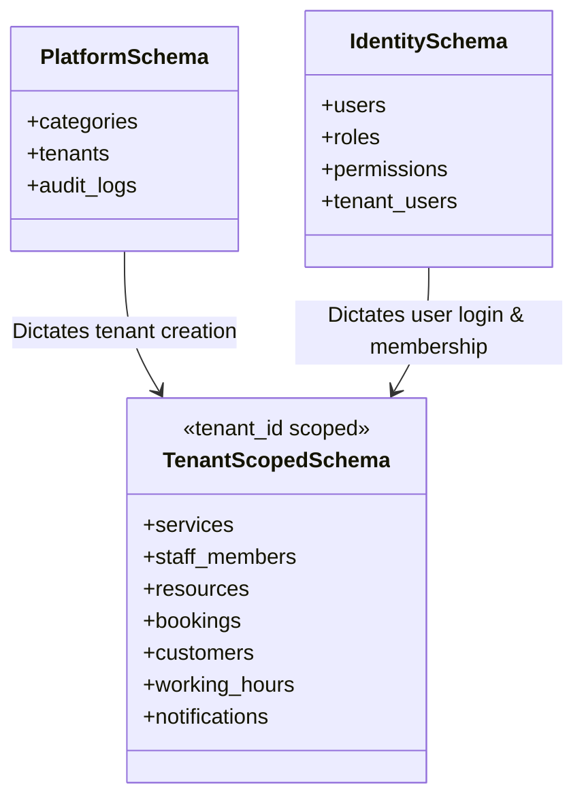

# ReserveFlow: Database and Multi-Tenancy Understanding

While the Angular frontend does not construct SQL queries, it must understand the backend multi-tenancy model to guarantee isolation, request validation, and contextual routing.

---

## 1. Multi-Tenancy Model: Shared Database + TenantId
ReserveFlow uses a **Logical Multi-Tenancy model** for the MVP:
* **Single Database:** One physical PostgreSQL database instance.
* **Discriminator Column:** Every table containing tenant-scoped data has a `tenant_id` column of type `UUID`.
* **Automatic Scope Filtering:** The EF Core DbContext applies a global filter: `HasQueryFilter(e => e.TenantId == _tenantContext.TenantId)`. Normal application code never writes raw `WHERE tenant_id = X`, preventing leaking.
* **Separation of Schemas:** The database is divided into module schemas for clean domain segregation.

---

## 2. Schema Structure & Entity Scoping



### A. Main / Platform Schema (`platform.`, `identity.`)
Global structures not isolated by `tenant_id`:
* **`tenants`:** Master tenant profiles (slugs, statuses, categories).
* **`categories`:** Global taxonomy tags for marketplace classification.
* **`users`, `roles`, `permissions`, `tenant_users`:** Keycloak identity hooks and memberships mapping users to tenants.
* **`audit_logs`:** System-wide log records.

### B. Module Schemas (`bookings.`, `catalog.`, `staffing.`, `resources.`)
Transactional data isolated by `tenant_id`:
* **`catalog.services`:** Services offered by a tenant.
* **`staffing.staff_members`**, **`resources.resources`**: Allocation tables isolated by tenant.
* **`bookings.bookings`**, **`bookings.booking_history`**: Appointment and schedule transactions.
* **`notifications.notification_messages`**: Outbox logs for the tenant's customer reminders.

---

## 3. How Frontend Passes Tenant Identity
To guide the backend query processor, the Angular client passes tenant information dynamically:

```text
                                       HTTP Request Headers
                               +----------------------------------+
                               | Authorization: Bearer <JWT>      |  <- Mapped to user tenant context
  Angular Client API Request ->| X-Tenant-Slug: smile-dental      |  <- Scopes public booking context
                               | X-Tenant-Id: <UUID>              |  <- Optional test/integration hook
                               +----------------------------------+
```

1. **Via JWT Claims (Authenticated Paths):** For `/admin/*` and `/staff/*` paths, the frontend appends the Keycloak Bearer Token. The backend extracts the user's `sub` claim, looks up the local `tenant_users` membership, and assigns the mapped `TenantId` to the request context.
2. **Via Route & Headers (Public paths):** For public booking wizards (where the customer is anonymous), the client extracts the tenant slug from the routing path (`/t/:tenantSlug`) and appends it as an `X-Tenant-Slug` HTTP header. The backend resolves the slug to locate the active `TenantId`.

---

## 4. Platform Scope vs. Tenant Scope
The UI routes Platform Admin screens differently from Tenant Admin screens:

* **Platform Admin Scope:** Calls endpoints under `/api/platform/*`. These endpoints bypass `TenantId` filters (using specialized query handlers that explicitly call `IgnoreQueryFilters()`) to load system aggregates, categories, and audits.
* **Tenant Admin Scope:** Calls endpoints under `/api/admin/*`. These requests strictly execute within the bounds of a single `TenantId` associated with the admin's login profile, preventing any cross-tenant data leaks.
