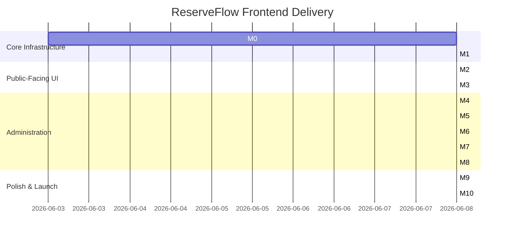

# ReserveFlow: Frontend Implementation Roadmap

This document outlines the step-by-step milestones to construct, verify, and polish the ReserveFlow Angular client.

---

## Milestone Board Overview

---

## Detailed Milestone Specifications

### Milestone 0: Frontend Foundation
* **Goal:** Initialize a clean, scalable Angular 21 project ready for feature modularity.
* **Pages:** Landing route placeholders, layout shells.
* **Components:** UI shells, primitive layout templates (`PublicLayout`, `AdminLayout`).
* **API Dependencies:** None.
* **Acceptance Criteria:**
  * Application builds without console errors.
  * Router redirects unknown links to `NotFoundComponent`.
  * Environment config parameters can be updated dynamically via Docker runtime parameters.

### Milestone 1: Auth & Tenant Context
* **Goal:** Connect application credentials and session storage to Keycloak OIDC.
* **Pages:** `/auth/login`, `/forbidden`, `/customer/profile`.
* **Components:** Global user info dropdown, user menu widget.
* **API Dependencies:** Keycloak discovery endpoint, `GET /api/auth/me`.
* **Acceptance Criteria:**
  * Unauthorized users trying to access `/admin` or `/platform` are redirected to Keycloak.
  * Verified JWT bearer token is appended to API headers.
  * Access tokens refresh in the background automatically.

### Milestone 2: Public Marketplace
* **Goal:** Enable customers to locate businesses.
* **Pages:** `/` (Marketplace Home), `/categories`, `/categories/:categorySlug`, `/t/:tenantSlug` (Tenant Profile).
* **Components:** Category grid, tenant listing card, service card.
* **API Dependencies:** `GET /api/public/categories`, `GET /api/public/tenants`.
* **Acceptance Criteria:**
  * Search bar filters tenant list dynamically.
  * Clicking on a category slug updates the URL and lists related businesses.

### Milestone 3: Public Booking Flow
* **Goal:** Create appointments anonymously.
* **Pages:** `/t/:tenantSlug/book`, `/booking/:bookingCode`.
* **Components:** Stepper wizard container, Date-picker calendar, Available slot grid, customer details form.
* **API Dependencies:** `GET /api/public/tenants/{slug}/availability`, `POST /api/public/tenants/{slug}/bookings`.
* **Acceptance Criteria:**
  * Slot search updates when selecting a different staff member or date.
  * Submitting a valid booking returns a confirmation page containing the unique code.

### Milestone 4: Platform Admin
* **Goal:** Manage global SaaS tenants and platform parameters.
* **Pages:** `/platform`, `/platform/tenants`, `/platform/categories`, `/platform/audit-logs`.
* **Components:** Tenant CRUD dialogs, Activate/Suspend toggle switches, Category table, audit grid.
* **API Dependencies:** Platform admin endpoints (`/api/platform/*`).
* **Acceptance Criteria:**
  * Platform admin can create a tenant with a slug.
  * Suspended tenants trigger the `/t/suspended` screen instantly on public routes.

### Milestone 5: Tenant Admin Core
* **Goal:** Enable business admins to declare services, staff, and resources.
* **Pages:** `/admin/services`, `/admin/staff`, `/admin/resources`, `/admin/settings`.
* **Components:** Service configuration forms, resource allocation selectors.
* **API Dependencies:** Tenant admin CRUD endpoints (`/api/admin/services`, `/api/admin/staff`, etc.).
* **Acceptance Criteria:**
  * Forms reject invalid entries (negative pricing, empty service names).
  * Admins can bind resources and staff members to specific services.

### Milestone 6: Scheduling & Availability UI
* **Goal:** Define operating shifts and practitioner schedules.
* **Pages:** `/admin/working-hours`, `/admin/booking-policies`.
* **Components:** Operating hours editor grid, day-off selectors, policy configuration input cards.
* **API Dependencies:** `POST /api/admin/staff/{id}/working-hours`, `POST /api/admin/resources/{id}/working-hours`.
* **Acceptance Criteria:**
  * Staff scheduling views render working and blackout hours correctly.
  * Booking policy changes (such as cancellation limits) reflect immediately.

### Milestone 7: Booking Management
* **Goal:** Oversee and manipulate existing tenant appointments.
* **Pages:** `/admin/bookings`, `/booking/lookup`.
* **Components:** Full-screen calendar (day/week views), client detail slide-out drawer, cancellation dialog.
* **API Dependencies:** Booking query and lifecycle endpoints (`/api/admin/bookings/*`).
* **Acceptance Criteria:**
  * Calendar color-codes bookings by status.
  * Rescheduling a slot calls the validation API to verify slot availability beforehand.

### Milestone 8: Staff Panel
* **Goal:** Optimize schedule views and quick actions for practitioners.
* **Pages:** `/staff/schedule`, `/staff/unavailable-periods`.
* **Components:** Mobile agenda feed, Status trigger buttons (`Complete`, `No-Show`).
* **API Dependencies:** Staff panel endpoints (`/api/staff/*`).
* **Acceptance Criteria:**
  * Practitioners can check their schedule on mobile layouts.
  * Click actions update appointment statuses instantly.

### Milestone 9: Reports & Notifications
* **Goal:** Visualize performance data and outbox notification logs.
* **Pages:** `/admin/reports`, `/admin/notifications`.
* **Components:** Outbox log grid, failed attempt alert box, charts (utilization rate).
* **API Dependencies:** `/api/admin/reports/*`, `/api/admin/notification-logs`.
* **Acceptance Criteria:**
  * Outbox view lists sent, pending, and failed reminders with error messages.
  * Click to retry a failed email notification resubmits successfully.

### Milestone 10: Production Polish
* **Goal:** Performance optimizations, global layout audits, and error catching.
* **Pages:** Global audit across all feature routes.
* **Components:** Global Error boundary page, loading skeletons, responsive spacing fixes.
* **API Dependencies:** None.
* **Acceptance Criteria:**
  * App builds with maximum size optimizations.
  * No layout breaking is visible on mobile viewports.
  * Errors are handled without crashing the UI.
